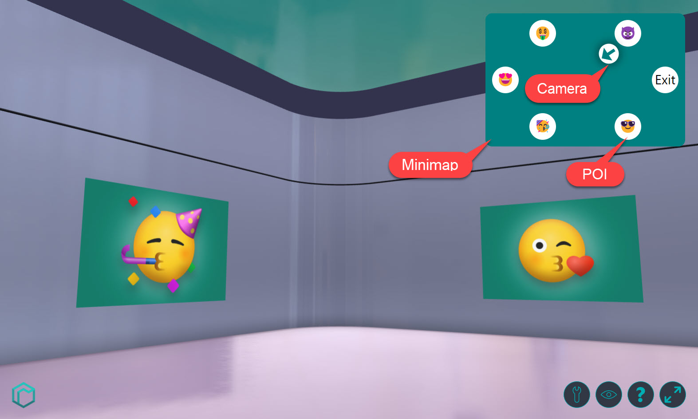

# Minimap

[Show Demo](./index.html)

::: info
This demo mostly utilizes the [`setCameraOrientation`](https://developers.rooom.com/docs/rooom-spaces/viewer/viewer-api/camera.html#setcameraorientation) and [`getCameraOrientation`](https://developers.rooom.com/docs/rooom-spaces/viewer/viewer-api/camera.html#getcameraorientation) method of the API of rooomSpaces.
You can read more about it [here](https://developers.rooom.com/docs/rooom-spaces/viewer/viewer-api/camera.html).
:::

## Goal
For this we take the interior of an exhibition as an example and define interesting points (POIs) that can be navigated via a minimap in the upper right corner of the screen. The user clicks on icons in the minimap and the camera is animated to the respective coordinate in the space. The current camera position and orientation is also displayed as an icon and permanently updated.

## Implementation

### HTML

First at all we will create our base structure.
In here the first thing we do is import the space-viewer script from rooom.
We also import our stylesheet and javascript which we will define further on.

```html
<!-- index.html -->
<html>
	<head>
		<title>Minimap</title>
		<link rel="stylesheet" href="style.css" />
		<script type="text/javascript" src="https://static.rooom.com/viewer-api/space-viewer-1.0.0.min.js"></script>
	</head>
	<body>
		<script src="script.js"></script>
	</body>
</html>
```

#### Add an iFrame
In order to show our space viewer, we need to add an iFrame inside our html body.
We don't need specify an `src` since the frame will be controlled by our script.
To use all features of the spaceViewer, the iFrame will also need some allowance as shown below.

```html
<body>
	<iframe
		id="iframe"
		src=""
		allow="autoplay; fullscreen; vr; xr"
		allowvr
		allowfullscreen
		mozallowfullscreen="true"
		webkitallowfullscreen="true"
	></iframe>
</body>
```

#### Add Minimap
The minimap should be located in the upper right corner of the screen. It shows the floor plan and 6 points of interest that we want to navigate to. In addition, the current location of the camera should be shown in the map (last child element in the minimap container), which also shows the viewing direction.



```html
<!-- Minimap -->
<div id="minimap">
	<div id="poi-1">😈</div>
	<div id="poi-2">🤑</div>
	<div id="poi-3">😍</div>
	<div id="poi-4">🥳</div>
	<div id="poi-5">😎</div>
	<div id="poi-6">Exit</div>
	<div id="camera">&#129033;</div>
</div>
```

That's it for the UI. Let's move on to the more exciting part of this tutorial - the implementation of the logic.

---

### Script

#### Initialization
For the initialization of the SpaceViewer we need the Id of the Space and an iFrame element. Then we start the instance of the SpaceViewer with these parameters.

::: info
There are many options to influence the startup behavior and appearance of the viewer. You can read more about them [here](https://developers.rooom.com/docs/rooom-spaces/viewer/customization.html).
:::

If the initialization is successful and the event ``viewer.start`` is triggered we can start all further logics within this function. 

::: info
Which further events the viewer sends can be found [here](https://developers.rooom.com/docs/rooom-spaces/viewer/viewer-api/events.html).
:::

```js
// script.js

// init the viewer with the viewerId and an iFrame element
const viewerID = '187593a5531f0dbbed9c9f11f8d363'
const iframe = document.getElementById('iframe')
const viewer = new SpaceViewer(iframe)

viewer.init(viewerID, {
	// options to influence the startup behavior
	autostart: true,
	render_background: true,

	// handler if initialization of api succeeded
	onSuccess: (api) => {
		// viewer started successfully event
		api.on('viewer.start', () => {
			// logic here
		})
	},
})
```

#### Unhide the minimap
The minimap is already displayed although the viewer is not yet started. To prevent this we set the visibility via CSS to ``hidden`` and change the attribute back to ``visible`` after the viewer is started.

```js
api.on('viewer.start', () => {
	// unhide the minimap
	document.getElementById('minimap').style.visibility = 'visible'
})
```

#### Coordinates, POIs and Camera
Position coordinates are defined in 3d space by 3 axes X,Y and Z. The X-axis defines the length, the Z-axis the depth and the Y-axis the height of the space. In our example the height of the camera always remains constant at 1.6m.

A rotation in space can also be defined by 3 angles (Euler angles). These are given in radians, where a full rotation of 360° corresponds to the value of 2 * Pi. For our example, we only need the rotation around the Y-axis. We leave the other two at 0.

But where do I get the position data from? Let's use the ``getCameraOrientation`` function and output the current camera position and rotation in space to the console at regular intervals at 1s.

```js
setInterval(() => {
	api.getCameraOrientation((transform) => {
		console.log(transform)
	})
}, 1000);
```

We move to all points in the room we find interesting and store these values in an object. We name the keys the same as the ids of the POIs in the minimap.

```js
// POIs: position and rotation as xyz coordinates
const pois = {
	'poi-1': {
		position: [5, 1.6, 2.25],
		rotation: [0, 0, 0],
	},
	'poi-2': {
		position: [-5, 1.6, 2.25],
		rotation: [0, 0, 0],
	},
	'poi-3': {
		position: [-6.75, 1.6, 0],
		rotation: [0, - Math.PI/2, 0],
	},
	'poi-4': {
		position: [-5, 1.6, -2.25],
		rotation: [0, Math.PI, 0],
	},
	'poi-5': {
		position: [5, 1.6, -2.25],
		rotation: [0, Math.PI, 0],
	},
	'poi-6': {
		position: [6.75, 1.6, 0],
		rotation: [0, Math.PI/2, 0],
	},
}
```	

#### Animate the camera to a POI
Matching the function ``getCameraOrientation`` there is the function ``setCameraOrientation``. With this function it is possible to animate the camera position and rotation. The duration of the animation is given in seconds.
So we just have to assign a click event to each POI in the minimap, take the coordinates and animate the camera there.

```js
// attach eventListeners to the pois and trigger camera animation
for (const key in pois) {
	const poi = pois[key]
	const element = document.getElementById(key)
	element.addEventListener('click', () => {
		api.setCameraOrientation(poi.position, poi.rotation, 2)
	})
}
```

#### Update the camera position in the minimap
For the calculation of the current camera position in the minimap we also need the dimension of the room. We move the camera to the lower left and upper right corner of the room and store this in a variable as well. We are only interested in the x and z values of the position data.

```js
// space dimension in x and z direction
let spaceDimension = {
	min: [-12, -7.9],
	max: [11.8, 7.6],
}
spaceDimension.width = spaceDimension.max[0] - spaceDimension.min[0]
spaceDimension.length = spaceDimension.max[1] - spaceDimension.min[1]
```

With this information we can write a little helper function that returns 2d coordinates from the 3d coordinates of the camera and the dimensions of the space that we can apply directly as CSS style parameters to the camera marker in the map.

```js
// Camera marker in the minimap
const cameraElement = document.getElementById('camera')

// helper function to calculate the position of the camera marker in the minimap
function updateCameraMarker(transform) {
	const left = ((transform.position[0] - spaceDimension.min[0]) / spaceDimension.width) * 100
	const bottom = ((transform.position[2] - spaceDimension.min[1]) / spaceDimension.length) * 100
	const angle = (transform.rotation[1] * 180) / Math.PI

	// update css styles
	cameraElement.style.left = `${left}%`
	cameraElement.style.bottom = `${bottom}%`
	cameraElement.style.transform = `translate(-50%, 50%) rotate(${angle}deg)`
```	

We simply modify our interval function to get the current coordinates of the camera and update the minimap. Decreasing the interval time will make the animation of the camera in the minimap more smooth.

```js
// get the current camera orientation and update the camera on minimap
const cameraElement = document.getElementById('camera')
setInterval(() => {
	api.getCameraOrientation((transform) => updateCameraMarker(transform))
}, 10);
```

With everything setup, the space can now explored with the help of a minimap.
Feel free to add your own style and logic to it.

